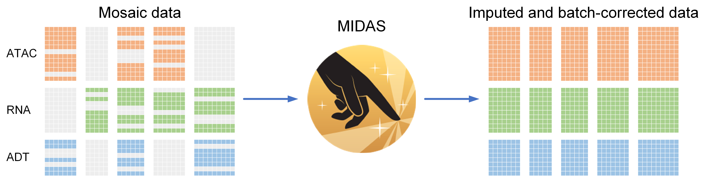

.. midas-reproducibility documentation master file, created by
   sphinx-quickstart on Mon Jan 23 12:44:44 2023.
   You can adapt this file completely to your liking, but it should at least
   contain the root `toctree` directive.

MIDAS' reproducibility documentation
=================================================

---An instruction for reproducing the manuscript results.

   MIDAS turns mosaic data into imputed and batch-corrected data to support single-cell multimodal analysis.

.. toctree::
   :maxdepth: 2
   :caption: Contents:

   prepare.md
   mosaic.md
   atlas.md
   transfer.md
